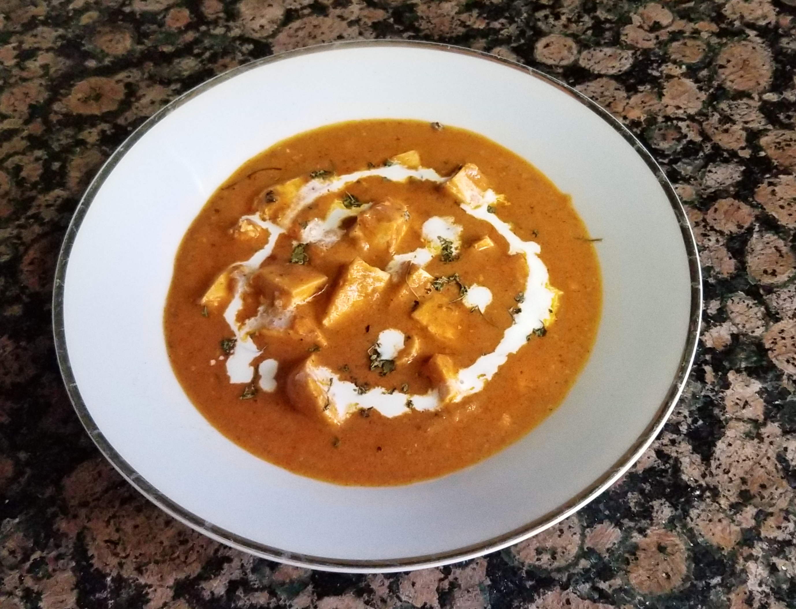
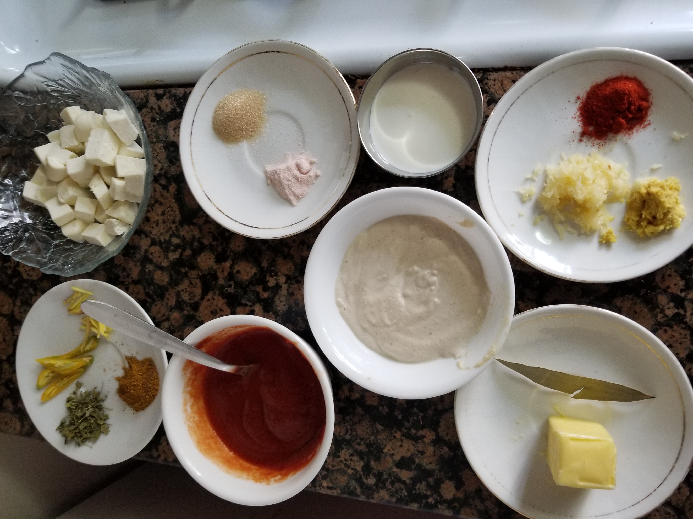

# Curry Heaven
## By 10-year-old chef Eshan

## How I started My Cooking Journey?
When I was 9 years old I started watching the cooking channel America's Test Kitchen and others, when I saw the final dish I wanted to try those dishes. Later I began to watch the YouTube channel Mark Wiens, he is a food person who loves to eat different kinds of food from all over the world. Whenever I see his videos about the food I get fascinated about the colorful food and different techniques and textures and that makes my mouth water.

My mom has a love and passion for cooking and I have seen my mom trying out new dishes and then I started slowly helping her in easy things like stirring the curry, garnishing the food, and more. Then this summer during the lockdown I wanted to try something new with my mom that involves cooking, under my mom's guidance I decided to learn how to cook pancakes. When I tried to cook the pancake for the first time I had some difficulties like pouring the batter into the pan, adjusting the temperature, and flipping the pancake. It took me a few days to get the hang of it, but soon I was able to make pancakes all by myself without any help.

Then later on I started learning how to make dosas, sandwiches, and omelets. That is how I got my interest in cooking. I am still learning to make new dishes like Indian dishes on the weekends. I am looking forward to making Thai, Chinese, Italian food, and different kinds of food.

## Dish 1. Paneer Butter Masala.

Paneer butter masala is a north Indian Cuisine dish. It is a rich and creamy dish made of tomatoes, butter, and cashew sauce.

## About this Paneer Butter Masala Recipe
This recipe contains Makhani gravy and Cream.
The makhani sauce is prepared with fresh tomatoes, cashews, and butter. Adding the cream thickens the gravy slightly and makes it rich.

## Serving Ideas

With Indian bread: You can serve this dish with naan bread or tandoori roti or plain paratha.
With rice: It also goes well with steamed basmati rice or jeera rice.
Or veggie pulao.

## How to make Paneer Butter Masala
### A step-by-step guide
   Preparation
   
   
   
1. Soak 20 cashews in a cup of hot water for 20 minutes.
2. When the cashews are soaking, you can prepare the other ingredients like chopping tomatoes, chopping and preparing the ginger garlic paste, slicing the paneer, and others.
3. Crush 1-inch ginger and 4 medium-sized garlic to a paste. Keep aside.
4. After 20 minutes, drain the water and add the soaked cashews in a blender. Also, add 3 tablespoons of water.
5. Grind to a smooth paste without any tiny bits or pieces of cashews.
6. Remove the cashew paste in a bowl and keep aside.
7. In the same blender add 2 cups of diced tomatoes.
8. Blend to a smooth tomato puree. Keep aside. Don’t add any water while blending the tomatoes.

   Making makhani gravy
9. Heat a thick pan, add 2 tablespoons butter, Add 1 Tej Patta (Indian bay leaf).
10. Fry for 3 seconds, Add the prepared crushed ginger garlic
11. Fry for some seconds till the ginger-garlic disappears.
12. Pour the prepared tomato puree.
13. The tomato puree mixture will start simmering.
14. Simmer the puree for 5 to 6 minutes.
15. Then add 1 teaspoon Kashmiri red chili powder.
16. Mix well and continue to stir the tomato puree.
17. Saute till the butter starts leaving the sides of the pan and the entire tomato puree mixture comes together as a whole. 
18.  Now add the prepared cashew paste and Mix the cashew paste very well with the cooked tomato puree and continue to Stir nonstop after adding cashew paste for 3 to 4 minutes.
19. Add 2 cups of water, Mix the water very well with the tomato-cashew makhani masala.
20. After 2 mins, add ginger julienned, add 2 slit green chilies, Add salt for taste and simmer for a minute.
21. After the gravy thickens, then add the sliced paneer in the makhani gravy.
22. Add 1 teaspoon crushed Kasuri methi leaves, followed by 1 teaspoon garam masala in the gravy.
23. Next add 2 tablespoons of low-fat cream Stir well and switch off the flame. 
24. Serve with naan bread or tandoori roti, it also goes well along with steamed basmati rice.

### Video

<iframe width="560" height="315" src="https://www.youtube.com/embed/7AjpRRJiRRY" frameborder="0" allow="accelerometer; autoplay; clipboard-write; encrypted-media; gyroscope; picture-in-picture" allowfullscreen></iframe>

### Recipe Card
for 4 people
#### Ingredients
*  20 whole cashews
* 1/3 cup hot water for soaking cashews
for preparing tomato puree
 * 2 cups diced tomatoes or 300 grams tomatoes or 5 medium size - pureed
for making paneer butter masala
  * 2 tablespoons butter or 1 tablespoon oil + 1 or 2 tablespoons butter
  * 1 tej patta (Indian bay leaf)
  * 1-inch ginger and 3 to 4 garlic - crushed or ground in a mortar and pestle
  * ½ to 1 teaspoon Kashmiri red chili powder or deghi mirch - if using any other chili powder you can add ¼ to ½ teaspoon
  * 1.5 cups water or add as required
  * 1-inch ginger julienned, 
  * 1 or 2 green chili - slit
  * 200 to 250 grams paneer (cottage cheese) 
  * 1 teaspoon Kasuri methi (dry fenugreek leaves) 
  * ½ to 1 teaspoon garam masala or tandoori masala
  * 2 to 3 tablespoons low-fat cream or 1 to 2 tablespoons heavy whipping cream
  * ¼ to 1 teaspoon sugar 
  * salt
 for garnishing
  *  1 to 2 tablespoons chopped coriander leaves (cilantro leaves) for garnishing
  * a few ginger julienne
  * 1 tablespoon low fat cream 1 tablespoon heavy whipping cream
  * 1 to 2 teaspoons butter
 

